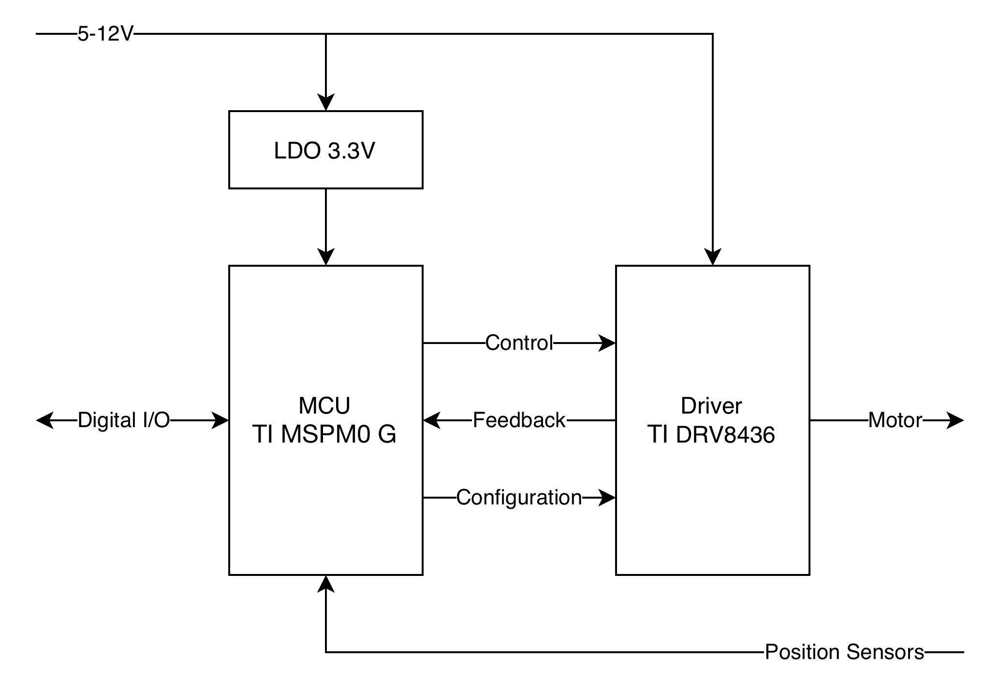

# PCB Design

This section covers initial component selection and schematic capture, supported by Electrical Rules Checks (ERC) to catch potential circuit errors early. It then guides you through configuring KiCad's Design Rule Checker (DRC) for our specific manufacturer, leading into the hands-on component placement and trace routing.

**Tools:** Diagram Editor (draw.io), KiCad 10, git

## Architectural Idea

Every design starts with a conceptual idea. For this guide, our objective is to build a flexible, smart bipolar stepper motor driver. We'll leverage a budget-friendly [MSPM0G1505](https://www.ti.com/product/MSPM0G1505) microcontroller to run the smart logic, paired with the popular Texas Instruments [DRV8436](https://www.ti.com/product/DRV8436) stepper driver to manage the heavy lifting at the motor coils.

Since both chips are complex, jumping straight into the schematic can be overwhelming. Instead, we'll start by sketching a high-level block diagram in an editor like draw.io. This step allows us to map out features, define peripheral connections, and solidify our design requirements early on.

While a block diagram can sometimes be skipped for trivial designs, creating one for this project keeps the "big picture" in focus while explicitly listing every feature we need to implement:

* **MCU Driver Control:** The microcontroller manages the stepper driver using the standard digital control lines: `ENABLE`, `DIR`, `STEP`, and an active-low `nSLEEP` signal.
* **Diagnostic Feedback:** To monitor system health, the MCU tracks the driver's open-drain `nFAULT` line, while sampling the internal logic voltage (`DVDD`) and charge pump output (`VCP`) via internal ADC channels.
* **Driver Configuration:** The hardware allows full customization of the driver's behavior. The MCU sets the microstepping resolution via `M0` and `M1`, configures the decay mode and off-time (`DECAY0`, `DECAY1`, `TOFF`), and limits the chopping current by feeding a reference voltage (`VREF`) from an onboard DAC.
* **Power Delivery:** The device can be protected from overvoltage with TVS diode, from overcurrent with resetable fuse, and frome reverse polarity with MOSFET. The stepper driver runs directly off the main power rail, while a 3.3V DC/DC converter provides a dedicated supply for the microcontroller and logic circuitry.
* **External Communication & Debugging:** For external control and programming, the MCU exposes a UART interface alongside a standard 2-pin SWD (Serial Wire Debug) port.
* **Position & Endstop Sensing:** To support homing or position tracking, the MCU includes two dedicated input ports for external photointerrupters.

It is critical to thoroughly understand the implementation requirements of each featured block. If any part of the circuit introduces an unknown - whether it is an unfamiliar interface or you aren't sure about a part's behavior in given conditions - pause and investigate. Often, these doubts can be cleared up simply by carefully rereading the component's datasheet or analyzing a manufacturer's reference design. When documentation isn't enough, taking a brief detour to validate the circuit through a simulation or a small prototype is essential. Catching a design flaw early on a test bench is a minor adjustment; catching it after a manufacturing run means an expensive, time-consuming spin of the board.

Let's double-check our feature requirements to ensure there are no lingering unknowns:

* **Driver Control:** `DIR`, `STEP`, and `nSLEEP` are standard logic-level inputs with a 0–0.6V logic-low and 1.5–5V logic-high range, allowing direct connection to the MCU's GPIOs. `ENABLE` is a tri-level input internally pulled to `DVDD` via a 10µA current source and tied to GND by a 200kΩ resistor; because its voltage never exceeds 2V, it is perfectly safe to connect directly to a 3.3V MCU GPIO. This block consumes **4 GPIO pins**.
* **Diagnostic Feedback:** `nFAULT` is an open-drain output that can be pulled up to 3.3V and connected directly to an MCU input. The DVDD voltage can be monitored by the MCU's ADC using an internal Op-Amp (OPA) configured as a buffer to match impedance across a resistor divider. Similarly, the MCU monitors the charge pump voltage (`VCP`), but a dedicated external buffer is required here to prevent the measurement circuitry from interfering with the charge pump's operation. This block requires **1 GPIO pin and 2 ADC/OPA input pins**.
* **Driver Configuration:** `M0`, `DECAY0`, and `DECAY1` are tri-level inputs consuming 3 pins. `M1` and `TOFF` are quad-level inputs; to achieve four distinct states using digital logic, they each require a pair of pins. Finally, 1 DAC output pin is needed to drive the stepper's analog `VREF` (0–3.3V) line. This block consumes **7 MCU pins**.
* **Power Delivery:** The input protection circuit is straightforward: a reverse-polarity protection MOSFET will use a Zener diode to clamp its gate-source voltage, ensuring safety since standard MOSFET gates cannot handle the full 12V motor supply rail. For the 3.3V logic rail, an LDO (such as the AP2210K-3.3) is perfectly adequate. The total current budget for the MCU and status LEDs should not exceed 25mA. With a 12V input, the LDO dissipates roughly 220mW, which is well within safe operating limits for standard ambient temperatures.
* **External Communication & Debugging:** Programming and debugging are handled via a standard 3-pin setup (`NRST`, `SWDIO`, and `SWCLK`). External UART communication takes an additional pair of MCU pins, ideally chosen to be 5V-tolerant for easier interfacing. This block consumes **4 assignable pins and NRST**.
* **Position & Endstop Sensing:** Each of the two photointerrupters requires one high-drive GPIO pin to power its IR LED and one input pin to read the sensor output, consuming **4 GPIO pins** in total.

Summing up our pin allocation gives us exactly what we need:

Total Pins = 4 (Control) + 3 (Feedback) + 7 (Config) + 4 (Communication)} + 4 (Sensors) = 22 pins

With 22 functional pins allocated, we can confidently use our target MCU in the 28-VSSOP package (which provides 24 available pins) while still retaining 2 spare GPIO pins for flexibility.

The electrical specifications align seamlessly, the power budget is well within thermal limits, and our pin mapping checks out perfectly. We can move forward into the schematic capture phase.
