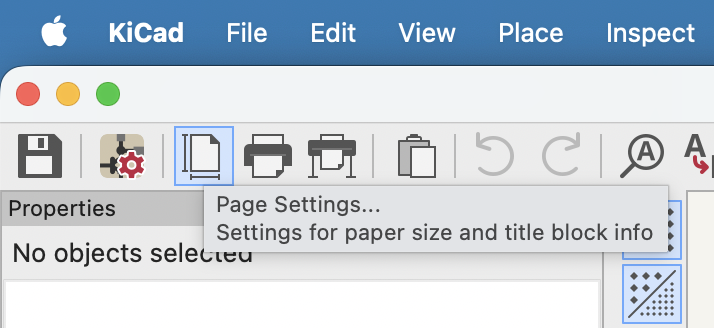
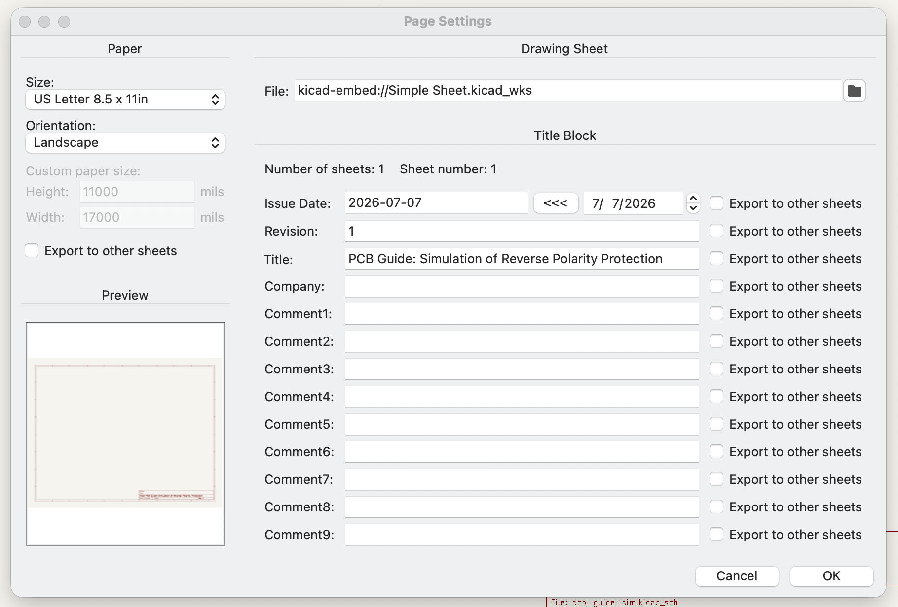

# Detour: Testing Assumptions

Taking a detour to simulate a circuit block and test it on a bench is a great way to eliminate uncertainties before committing to a whole device design. This validation process bridges the gap between an idea of a circuit behavior and detailed understanding. A MOSFET-based reverse-polarity protection circuit serves as a solid example for this exercise, offering a straightforward yet critical sub-circuit to demonstrate the complete workflow.

## Simulation Project & Workspace Setup

To begin, let's walk through a few optional preparatory steps to set up our environment.

1. **Initialize the Project**: Create a new KiCad project from a default template. Because this exercise focuses mainly on simulation, the PCB layout file (.kicad_pcb) can be safely deleted.

2. **Version Control Configuration**: To track simulation history, experiment with different configurations, or share your progress, initialize a Git repository within the project directory. The companion repository created specifically for this detour can be found at [github.com/vasili-v/pcb-guide-sim](https://github.com/vasili-v/pcb-guide-sim). KiCad is very friendly with Git but several things may be added to the project to compliment it:

    * Use a .gitignore file to exclude temporary simulation outputs and non-essential build files.
    * Add a license file to define clear usage and distribution terms for others.
    * Add a README.md file containing a brief description of the circuit and its key simulation parameters.

3. **Configure the Schematic Page**: To properly document the project before diving into the design, open the schematic editor (.kicad_sch) and use the page settings to populate the title block with the date, revision number, project title, and preferred page size.

 
